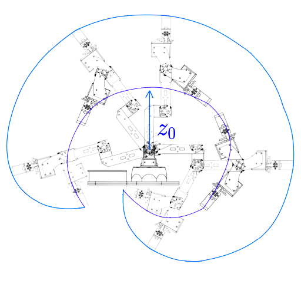

# PincherX-100 Robot – Simulation and Control

This repository contains a full framework to model, simulate, and control the PincherX-100 robotic arm using Python, ROS, and RViz. The project covers forward/inverse kinematics, Jacobian-based control, iterative planning, and automated object manipulation tasks.

## Robot Specifications

- Model: PincherX-100 (Interbotix)
- Degrees of Freedom (DOF): 4 revolute joints
- Actuators: Dynamixel servos (via USB interface)
- Reach: Approx. 30 cm
- End-effector: 2-finger gripper
- Controller: Interbotix Python SDK
- Simulation: RViz (non-physical)

## Features

| Module                      | Description                                                                 |
|----------------------------|-----------------------------------------------------------------------------|
| Direct Kinematics          | Calculates end-effector pose from joint angles using DH convention          |
| Inverse Kinematics         | Derives joint angles from desired position + orientation                    |
| Jacobian-based Control     | Iterative algorithm with damping & null space projection                    |
| Actuator Mapping           | Translates between DH model and servo commands                             |
| Workspace Analysis         | 2D torus approximation using geometric constraints                         |
| Pick-and-Place Routines    | Simulated handling of multiple objects                                      |

## Setup (with Docker and WSL2)

To simplify installation, a full dockerized environment is available. It is cross-platform and avoids manual ROS configuration.

### Step-by-step guide:
Follow the instructions here:  
https://gitlab.isir.upmc.fr/khoramshahi/dockerized-pincherx

It includes:
- Ubuntu-based Docker container
- ROS environment
- Python simulation scripts
- RViz visualization

Works on both Ubuntu and Windows 11 with WSL2.

## Project Structure

```
├── detailed_report.pdf
├── codes/
│   ├── Full code-px100.py
│   └── robot_links_graph_code.py
├── media/
│   ├── workspace.png
│   ├── O1P1.pdf, O2P1.pdf, ...
├── video demonstration/
│   ├── part1.mp4
│   └── part2.mp4
├── README.md
```

## Running a Pick-and-Place Task

Example: picking and placing 3 objects from and to predefined positions.

```python
object1 = [[100, 250, 100], [90, -100, 10]]
object2 = [[20, 0, 250], [150, 50, 10]]
object3 = [[150, 0, 80], [40, -100, -30]]
```

The robot will:
- Move to grasp point
- Close the gripper
- Move to drop point
- Open the gripper
- Repeat for next object

## Workspace Visualization

The workspace is computed as a torus using analytic constraints from the inverse geometric model:

(L_3 - L_r)^2 < (p_x - L_4)^2 + (p_z - L_1)^2 < (L_3 + L_r)^2



## Video Demonstrations

The following videos illustrate the robot's simulated behavior during pick-and-place operations and iterative control.

- Part 1 – Static Inverse Kinematics Execution  
[Watch Video](Video_Demontration/Part1.mp4)

- Part 2 – Iterative Control and Full Pick-and-Place Sequence  
[Watch Video](Video_Demontration/Part2.mp4)

## Simulated Object Paths

Object 1:


Object 2:


Object 3:


## References

- PincherX-100 Specifications – Trossen Robotics  
https://docs.trossenrobotics.com/interbotix_xsarms_docs/specifications/px100.html

- Dockerized ROS Setup – GitLab @ ISIR  
https://gitlab.isir.upmc.fr/khoramshahi/dockerized-pincherx

## Author

@2ineddine

